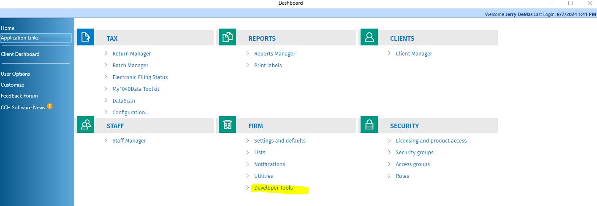
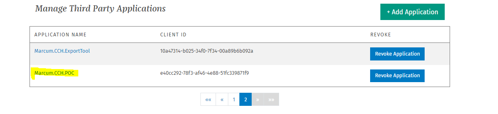
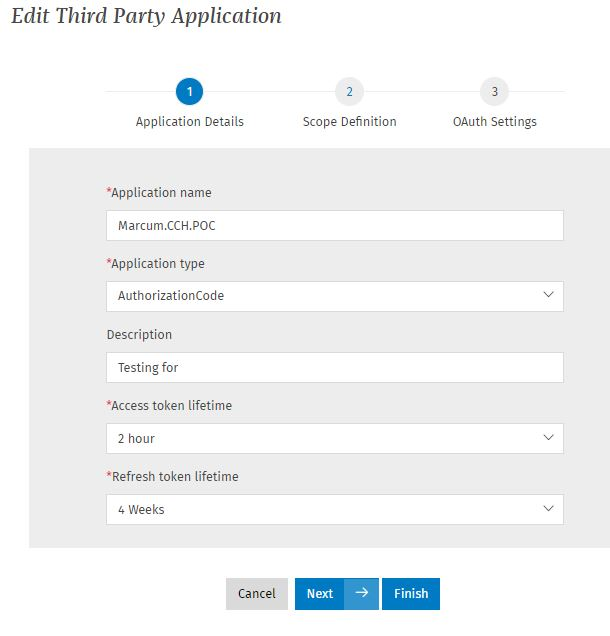
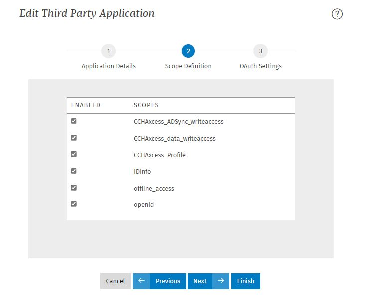
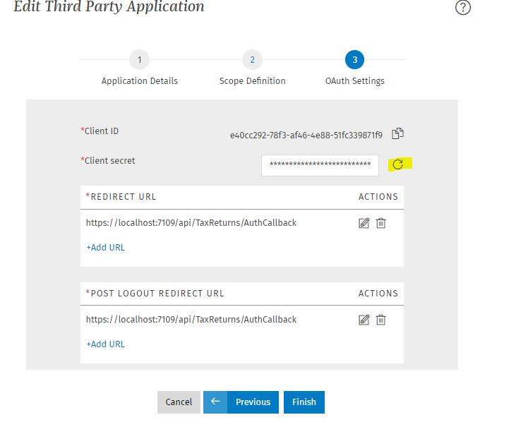
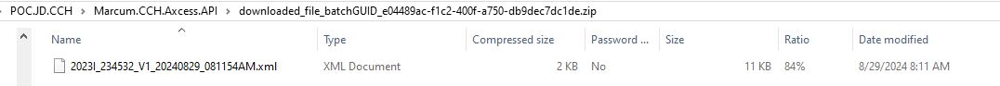

# Marcum.CCH
This project was created as a POC to see if we can retrieve a specific client's specific year's tax returns

### Developer

This was built by Jerry DeMas 8/7/2024
* Visual Studio 2022 17.10.3
* .NET 8

This project uses Swagger to test the API (https://localhost:7109/swagger/index.html)


## Steps for testing
Make sure that this project is setup / registered at CCH. If already registered move to testing.

### Setup / registration

CCH Dashboard > Application Links > Firm > Developer Tools \
   
\
If not already exists, add Application\
\
\
\
\
* Value in Client Id should be the value of ClientId in appsettings.json
* Value in Client Secret (would be copied when created) should be the value in ClientSecret in appsettings.json. This value needs to be reset often due to it's expiration lifetime.


### Testing
running swagger (https://localhost:7109/swagger/index.html), 
create the url\
\
copy the resulting url\
( example:  https://login.cchaxcess.com/ps/auth/v1.0/core/connect/authorize?response_type=code&client_id=[appsettings.json::clientId]&redirect_uri=[appsettings.json::RedirectUrl]&scope=CCHAxcess_data_writeaccess offline_access )

Paste the returned URL in a browser. This will call CCHaxcess end point. Returns to call this project's CchAuthCallback end point with a new code value. 
CchAuthCallback will use that code.

CchAuthCallback will use that code to re-call CCH [appsettings:TokenUrl] to return a new authorization token, and save it to C:\\CCH\\AuthFile.txt.
Example result:
```json
{
    "access_token":"xxx",
    "refresh_token": "xxx"
}
```

### Testing for getting status of a Tax Return


Passing the ReturnId in the form of \
[4 digit year][Single character return Type]:[ClientId]:[V][Version Number]\
2023C:123456:V1

Example result:
```json
{
    "BankInfo": "xxx
    "CategoryOfReturn": "xxx",
    "EPostMark": "\/Date(1729043021000-0500)\/",
    "FiscalYearBegin": "1\/1\/2023",
    "FiscalYearEnd": "12\/31\/2023",
    "Form8879DateReceived": "\/Date(-62135575200000-0600)\/",
    "IRSCenter": "xxx
    "IRSMessage": "",
    "IsPasswordProtected": false,
    "IsRefund": false,
    "IsSSN": false,
    "Name": "xxx
    "Notification": "Unknown",
    "PlanNumber": "",
    "PreparerName": "xxx
    "Product": "Corporation",
    "RefundAmount": 0,
    "ReturnID": "23C:123456:V1",
    "SsnEin": "xxx
    "StatusHistoryList": [{
        "AckDate": "\/Date(-62135575200000-0600)\/",
        "CategoryOfReturn": "Return",
        "DisplayCode": 0,
        "Form8879DateReceived": "\/Date(-62135575200000-0600)\/",
        "Form8879DateReceived_UpldLevel": "\/Date(-62135575200000-0600)\/",
        "IsActive": 0,
        "IsFBAR": false,
        "IsParticipatingInEsign": false,
        "MISBTID": "",
        "ModifiedByName": "xxx
        "ParentIsPassowordProtected": false,
        "ParentWasPasswordProtected": false,
        "StateCode": "",
        "StateDue": 0,
        "StatusDate": "\/Date(1728968400000-0500)\/",
        "StatusID": 110,
        "StatusText": "Upload Started",
        "SubmissionId": "",
        "UnitName": "",
        "UnmaskedMISBTID": "",
        "UnmaskedStateCode": "",
        "intCOR": 1
    }],
    "SubUnitList": [],
    "TaxYear": 2023,
    "TypeOfReturn": "Individual_Ext"
}
```

### Setting up a batch report for a list of Tax Returns

Passing the ReturnIds in an array in the form of \
[4 digit year][Single character return Type]:[ClientId]:[V][Version Number]\
[2023C:123456:V1,2023C:234567:V2, ...]

To have CCH convert the returns into the xml, place the following json in the body
```json
{
    "ReturnId": ["[returnId from the result of previous call]","xxxxx:xxxxxx:xx","xxxxx:xxxxxx:xx"],
    "ConfigurationXml": "<TaxDataExportOptions><ExportUnitsSelectionPreference>FilledWorksheetUnits</ExportUnitsSelectionPreference><DefaultPreferences><GenerateMeta>false</GenerateMeta><GenerateLookupItems>false</GenerateLookupItems><FieldValueExportSelection>OnlyFieldsWithData</FieldValueExportSelection><WorksheetGridExportMode>DetailMode</WorksheetGridExportMode><WhitepaperStatementExportMode>Suppress</WhitepaperStatementExportMode></DefaultPreferences><ExportDiagnosticsMode>Suppress</ExportDiagnosticsMode><CalcReturnBeforeExport>false</CalcReturnBeforeExport><DefaultFieldIdentifierPreference>Description</DefaultFieldIdentifierPreference></TaxDataExportOptions>"
}
```
Example result
```json
{
	"ExecutionID": "00000000-0000-0000-0000-000000000000",
	"FileResults": [
		{
			"FileGroupID": 1,
			"IsError": false,
			"Messages": [
				"00000000-0000-0000-0000-000000000000 submitted successfully."
			],
			"SubItemExecutionIDs": [
				"00000000-0000-0000-0000-000000000000"
			]
		}
	]
}


```

To get the status of the return to see if we want to download the return use GetBatchStatus call using the "ExecutionID" from the previous call

Example result
```json
{
  "BatchStatus": "BACMP",
  "BatchStatusDescription": "Complete",
  "Items": null
}
```

If complete, then let's setup the download


Use the same ExecutionID value to run this next api
Example result
```json
[{
    "BatchItemGuid": "00000000-0000-0000-0000-000000000000",
    "FileName": "output.zip",
    "Length": -1
}]
```


Download the created zipped xml file using the ExecutionID, BatchItemGuid, and fileName from the previous calls.

Result
```text
File downloaded successfully to downloaded_file_batchGUID_e04489ac-f1c2-400f-a750-db9dec7dc1de.zip)
```

This file, as it is, will download to the project root directory. This can be changed to meet your needs.



